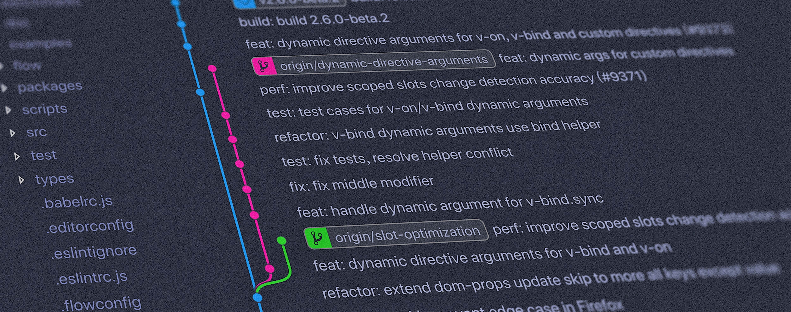

## Git简介

`Git` 是一种分布式版本控制系统，它可以不受网络连接的限制，加上其它众多优点，目前已经成为程序开发人员做项目版本管理时的首选，非开发人员也可以用 `Git` 来做自己的文档版本管理工具。

`Git` 的api很多，但其实平时项目中90%的需求都只需要用到几个基本的功能即可，所以本文将从 `实用主义` 和 `深入探索` 2个方面去谈谈如何在项目中使用 `Git`，一般来说，看完 `实用主义` 这一节就可以开始在项目中动手用。

<!-- more -->
## 实用主义

### 准备阶段

进入 Git官网下载合适你的安装包，当前我下载到的版本是 `2.23.0`，本文也将在这个版本上演示效果。

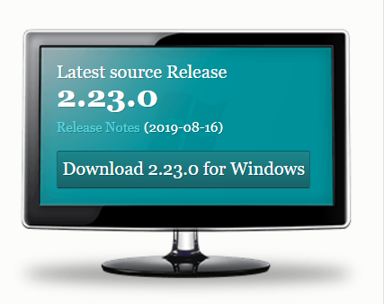

安装好 `Git` 后，打开命令行工具，进入工作文件夹（*为了便于理解，我以上传我的博客文件到GitHub为例*）。

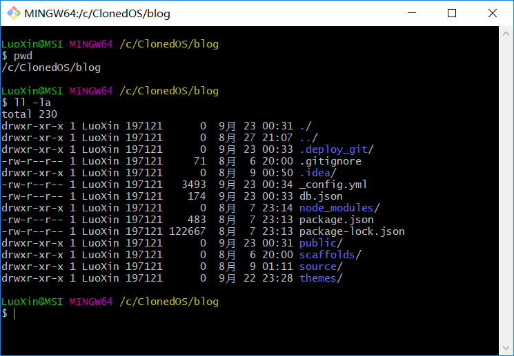

进入 Github网站 注册一个账号并登录，新建仓库`Blog`：https://github.com/akatouXin/Blog

点击 `HTTPS`，复制项目地址 ：`https://github.com/akatouXin/Blog.git` 备用。

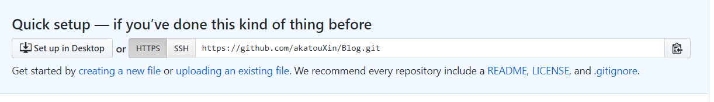

再回到命令行工具，一切就绪，接下来进入本文的重点。

### 常用操作

所谓实用主义，就是掌握了以下知识就可以玩转 `Git`，轻松应对90%以上的需求。以下是实用主义型的Git命令列表，先大致看一下

- `git clone`
- `git config`
- `git branch`
- `git checkout`
- `git status`
- `git add`
- `git commit`
- `git push`
- `git pull`
- `git log`
- `git reflog`
- `git tag`
- `git reset`
- `git revert`

接下来，将通过对：https://github.com/akatouXin/Blog

仓库进行实例操作，讲解如何使用 `Git` 拉取代码到提交代码的整个流程。


#### git clone

> 从git服务器拉取代码 

```shell
git clone https://github.com/akatouXin/Blog.git
```

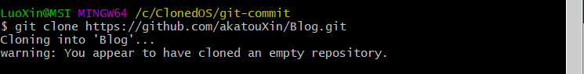

代码下载完成后在当前文件夹中会有一个 `Blog` 的目录，通过 `cd Blog` 命令进入目录。使用`ll -la` 命令可以看见有一个隐藏文件夹`.git`。`.git`中存放的就是`Blog`仓库在本地的Git信息。

#### git config 

> 配置开发者用户名和邮箱

```shell
git config user.name akatouXin 
git config user.email akatouXin@akatouXin.xom
```

每次代码提交的时候都会生成一条提交记录，其中会包含当前配置的用户名和邮箱。需要注意的是，这里的用户名和邮箱与Github的用户名与邮箱没有必然联系，这里配置的用户名邮箱只仅仅是在提交信息中显示。此外，还可以用`git config --global `来配置全局用户名邮箱。

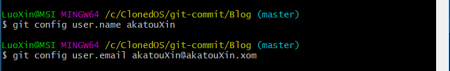

#### git branch

> 创建、重命名、查看、删除项目分支，通过 `Git` 做项目开发时，一般都是在开发分支中进行，开发完成后合并分支到主干。

```shell
git branch daily/0.0.0
```

创建一个名为 `daily/0.0.0` 的日常开发分支，分支名只要不包括特殊字符即可。

```shell
git branch -m daily/0.0.0 daily/0.0.1
```

如果觉得之前的分支名不合适，可以为新建的分支重命名，重命名分支名为 `daily/0.0.1`

```shell
git branch
```

通过不带参数的branch命令可以查看当前项目分支列表

```shell
git branch -d daily/0.0.1
```

如果分支已经完成使命则可以通过 `-d` 参数将分支删除，这里为了继续下一步操作，暂不执行删除操作

#### git checkout

> 切换分支

```shell
git checkout daily/0.0.1
```

切换到 `daily/0.0.1` 分支，后续的操作将在这个分支上进行

#### git status

> 查看文件变动状态

通过任何你喜欢的编辑器对项目中的 `README.md` 文件做一些改动，保存。

```shell
git status
```

通过 `git status` 命令可以看到文件当前状态 `Untracked files:` （*有未被git追踪的文件或文件夹，可以通过git add 命令将变动追加到暂存区*）

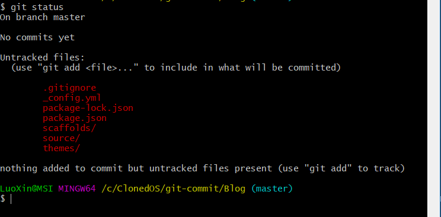

#### git add

> 添加文件变动到暂存区

```shell
git add .
```

通过指定文件名或者指定文件夹可以将该文件添加到暂存区，如果想添加所有文件可用 `git add .` 命令，这时候可通过 `git status` 看到文件当前状态 `Changes to be committed:` （*文件已提交到暂存区*）

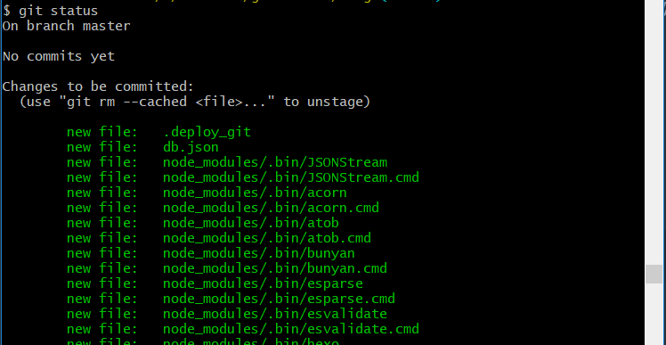

#### git commit

> 提交文件变动到版本库

```shell
git commit -m '这里写提交原因'
```

通过 `-m` 参数可直接在命令行里输入提交描述文本

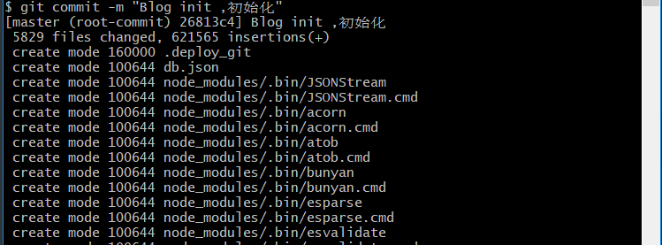

提交成功后，可以使用`git log`查看履历

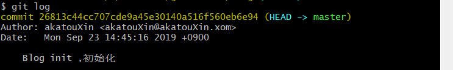

#### git push

> 将本地的代码改动推送到服务器

```shell
git push origin master
```

`origin` 指代的是当前的git服务器地址，这行命令的意思是把 `master` 分支推送到服务器，当看到命令行返回如下内容表示推送成功了。


现在我们回到Github网站的项目首页，就会看到刚才推送的 `master`内容了

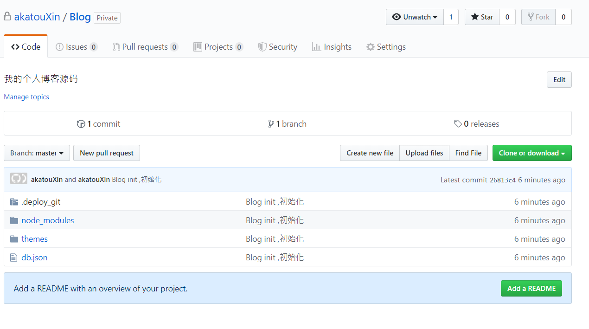

#### git pull

> 将服务器上的最新代码拉取到本地

```shell
git pull origin [分支名]
```

如果其它项目成员对项目做了改动并推送到服务器，我们需要将最新的改动更新到本地，这里我们来模拟一下这种情况。

进入Github网站的项目首页，再进入 master 分支，在线追加 `README.md` 文件做一些修改并保存，然后在命令中执行以上命令，它将把刚才在线修改的部分拉取到本地，用编辑器打开 `README.md` ，你会发现文件已经跟线上的内容同步了。

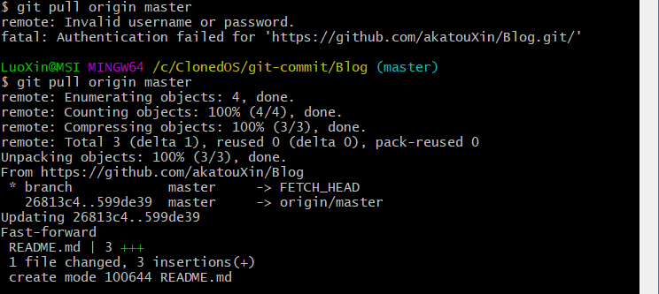

*如果线上代码做了变动，而你本地的代码也有变动，拉取的代码就有可能会跟你本地的改动冲突，一般情况下 Git 会自动处理这种冲突合并，但如果改动的是同一行，那就需要手动来合并代码，编辑文件，保存最新的改动，再通过 git add . 和 git commit -m 'xxx' 来提交合并。*

#### git log

> 查看版本提交记录

```shell
git log
```

通过以上命令，我们可以查看整个项目的版本提交记录，它里面包含了`提交人`、`日期`、`提交原因`等信息，得到的结果如下：

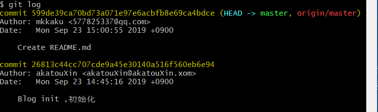

提交记录可能会非常多，按 `J` 键往下翻，按 `K` 键往上翻，按 `Q` 键退出查看。

此外`git log`还有其他的参数：`git log --pretty=oneline`,`git log --oneline`


#### git reflog

`reflog` 可以查看所有分支的所有操作记录（包括commit和reset的操作、已经被删除的commit记录，跟 `git log` 的区别在于它不能查看已经删除了的commit记录。

#### git tag

> 为项目标记标签，便于分类查看

```shell
git tag master/0.0.1
git push origin master
```

当我们完成某个功能需求准备发布上线时，应该将此次完整的项目代码做个标记，并将这个标记好的版本发布到线上，这里我们以 `master/0.0.1` 为标记名并发布，当看到命令行返回如下内容则表示发布成功了

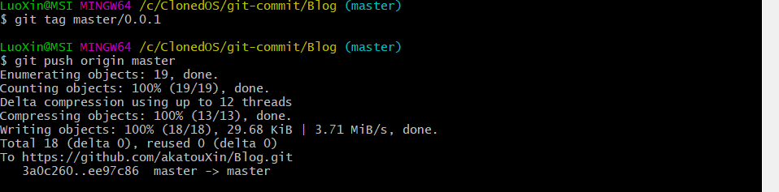

#### git reset

> 将当前的分支重设（reset）到指定的 `<commit>` 或者 `HEAD`   （相当于移动HEAD指针）

```shell
git reset --mixed <commit_id>
```

`--mixed` 是不带参数时的默认参数，它退回到某个版本，保留文件内容，回退提交历史。相当于在本地库和暂存区移动指针，将版本后退或者向前移动，但是工作区的文件并不会随之移动。

```shell
git reset --soft <commit_id>
```

暂存区和工作区中的内容不作任何改变，仅仅把 `HEAD` 指向 `<commit_id>`那次提交，只是将本地库的版本做变动，暂存区与工作区没有变动。

```shell
git reset --hard <commit_id>
```

自从 `<commit_id>` 以来在工作区中的任何改变都被丢弃，并把 `HEAD` 指向 `<commit_id>`那次提交。`--hard`命令是同步本地库，暂存区，工作区到`<commit_id>`对应的版本。**这个才是最常用的参数**。

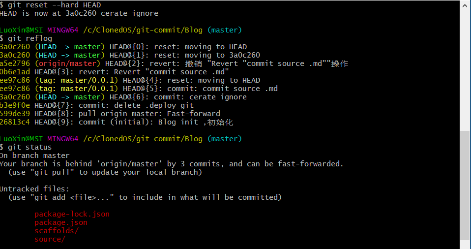

#### git revert

> 撤销某次操作，此次操作之前和之后的 `commit` 和 `history` 都会保留，并且把这次撤销作为一次最新的提交，***和`git reset`的方式回滚不一致的是，`git revert`仅仅是撤销某一次记录，并且把撤销动作作为新记录提交，该当记录前后的提交不改变。`git reset`重置的`HEAD`指向某一条记录，会将该当记录之后的也会被重置。***

```shell
git revert HEAD
```

撤销前一次提交操作

```shell
git revert HEAD --no-edit
```

撤销前一次提交操作，并以默认的 `Revert "xxx"` 为提交原因

```shell
git revert -n HEAD
```

需要撤销多次操作的时候加 `-n` 参数，这样不会每次撤销操作都提交，而是等所有撤销都完成后一起提交

撤销最近的一次：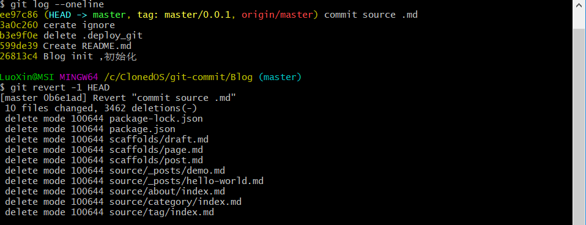

提交以后，远程仓库回滚：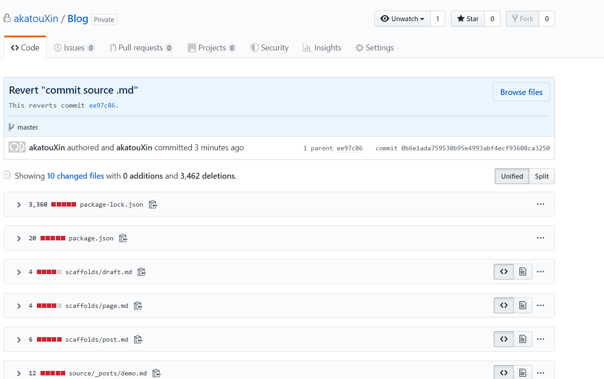

本地工作区回滚：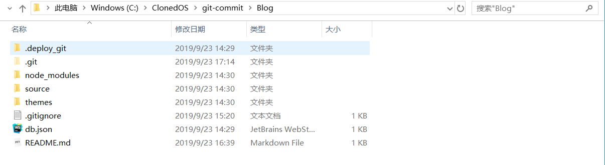

#### .gitignore

> 设置哪些内容不需要推送到服务器，这是一个配置文件

```shell
touch .gitignore
```

`.gitignore` 不是 `Git` 命令，而在项目中的一个文件，通过设置 `.gitignore` 的内容告诉 `Git` 哪些文件应该被忽略不需要推送到服务器，通过以上命令可以创建一个 `.gitignore` 文件，并在编辑器中打开文件，每一行代表一个要忽略的文件或目录，如：

```tex
.deploy_git/
```

以上内容的意思是 `Git` 将忽略 `.deploy_git/` 目录，这些内容不会被推送到服务器上

#### 小结

通过掌握以上这些基本命令就可以在项目中开始用起来了，如果追求实用，那关于 `Git` 的学习就可以到此结束了，偶尔遇到的问题也基本上通过 `Google`,`baidu` 也能找到答案，如果想深入探索 `Git` 的高阶功能，那就继续往下看 `深入探索` 部分。**结合[在线练习](https://learngitbranching.js.org/)网站进行练习。←很重要**
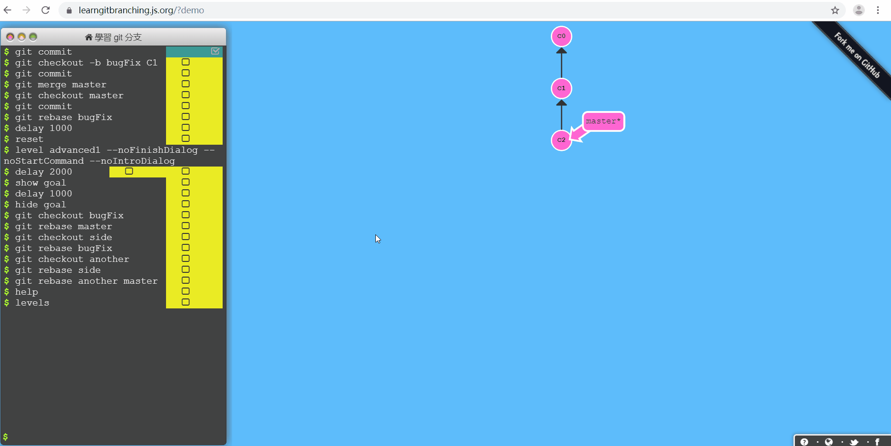

## 深入探索

### 基本概念

#### 工作区（*Working Directory*）

就是你在电脑里能看到的目录，比如上文中的 `Blog` 文件夹就是一个工作区

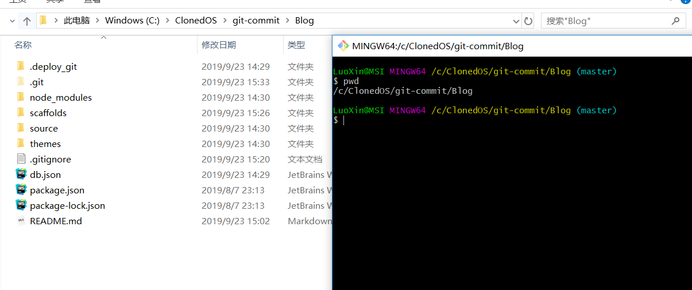

#### 本地版本库（*Local Repository*）

工作区有一个隐藏目录 `.git`，这个不算工作区，而是 `Git` 的版本库。

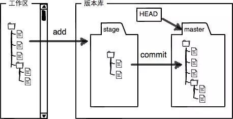

#### 暂存区（*stage*）

本地版本库里存了很多东西，其中最重要的就是称为 `stage`（或者叫index）的暂存区，还有 `Git` 为我们自动创建的第一个分支 `master`，以及指向 `master` 的一个指针叫 `HEAD`。

#### 远程版本库（*Remote Repository*）

一般指的是 `Git` 服务器上所对应的仓库，本文的示例所在的`github`仓库就是一个远程版本库


#### 以上概念之间的关系

`工作区`、`暂存区`、`本地版本库`、`远程版本库`之间几个常用的 `Git` 操作流程如下图所示：

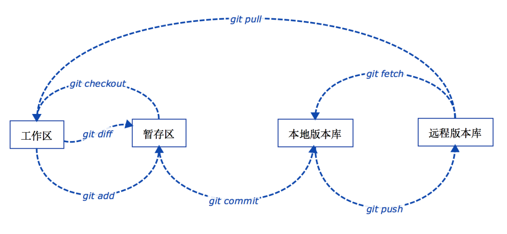

#### 分支（*Branch*）

分支是为了将修改记录的整个流程分开存储，让分开的分支不受其它分支的影响，所以在同一个数据库里可以同时进行多个不同的修改

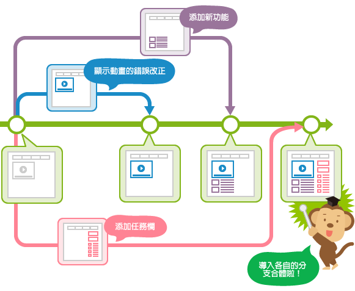

#### 主分支（*Master*）

前面提到过 `master` 是 `Git` 为我们自动创建的第一个分支，也叫主分支，其它分支开发完成后都要合并到 `master`

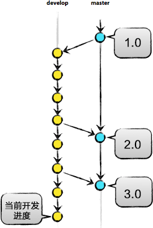

#### 标签（*Tag*）

标签是用于标记特定的点或提交的历史，通常会用来标记发布版本的名称或版本号（如：`master/1.0），虽然标签看起来有点像分支，但打上标签的提交是固定的，不能随意的改动，参见上图中的`1.0` / `2.0` / `3.0`。一般在`git flow 工作流`的`Release`版本中使用比较多

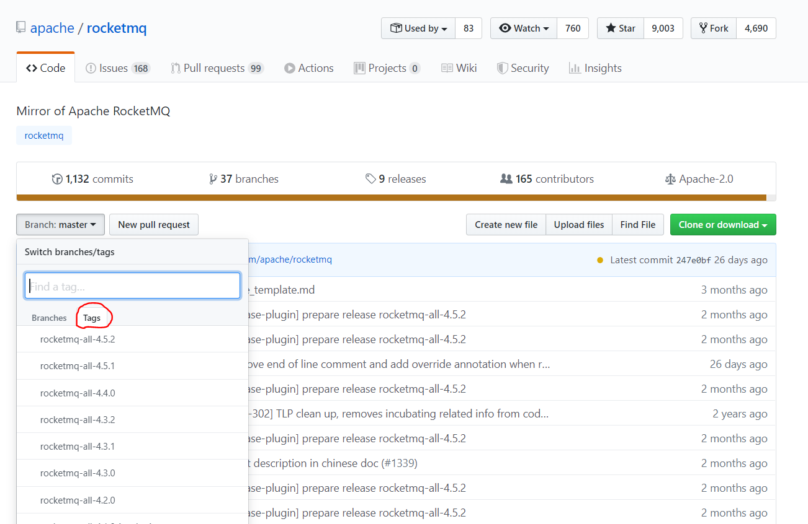

#### HEAD

`HEAD` 指向的就是当前分支的最新提交

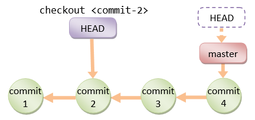

> 以上概念了解的差不多，那就可以继续往下看，下面将以具体的操作类型来讲解 `Git` 的高阶用法

### 操作文件

#### git add

> 添加文件到暂存区

```shell
git add -i
```

通过此命令将打开交互式子命令系统，你将看到如下子命令

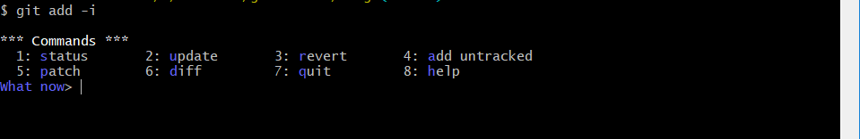

通过输入序列号或首字母可以选择相应的功能，具体的功能解释如下：

- `status`：功能上和 `git add -i` 相似，没什么鸟用
- `update`：详见下方 `git add -u`
- `revert`：把已经添加到暂存区的文件从暂存区剔除，其操作方式和 `update` 类似
- `add untracked`：可以把新增的文件添加到暂存区，其操作方式和 `update` 类似
- `patch`：详见下方 `git add -p`
- `diff`：比较暂存区文件和本地版本库的差异，其操作方式和 `update` 类似
- `quit`：退出 `git add -i` 命令系统
- `help`：查看帮助信息

```shell
git add -p
```

直接进入交互命令中最有用的 `patch` 模式

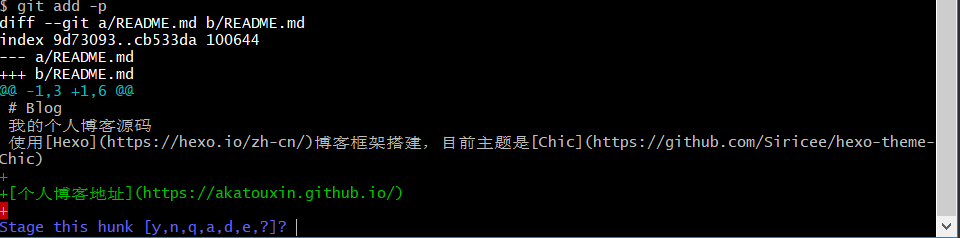

这是交互命令中最有用的模式，其操作方式和 `update` 类似，选择后 `Git` 会显示这些文件的当前内容与本地版本库中的差异，然后您可以自己决定是否添加这些修改到暂存区，在命令行 `Stage deletion [y,n,q,a,d,/,?]?` 后输入 `y,n,q,a,d,/,?` 其中一项选择操作方式，具体功能解释如下：

- y：接受修改
- n：忽略修改
- q：退出当前命令
- a：添加修改
- d：放弃修改
- /：通过正则表达式匹配修改内容
- ?：查看帮助信息

```shell
git add -u 
```

直接进入交互命令中的 `update` 模式

它会先列出工作区 `修改` 或 `删除` 的文件列表，`新增` 的文件不会被显示，在命令行 `Update>>` 后输入相应的列表序列号表示选中该项，回车继续选择，如果已选好，直接回车回到命令主界面

```shell
git add --ignore-removal .
```

添加工作区 `修改` 或 `新增` 的文件列表， `删除` 的文件不会被添加

#### git commit

> 把暂存区的文件提交到本地版本库

```shell
git commit -m '第一行提交信息'  -m '第二行提交信息'
```

不打开编辑器，直接在命令行中输入多行提交信息

```shell
git commit -am '提交信息'
```

将工作区 `修改` 或 `删除` 的文件提交到本地版本库， `新增` 的文件不会被提交

```shell
git commit --amend -m '提交信息'
```

修改最新一条提交记录的提交原因

```shell
git commit -C HEAD
```

将当前文件改动提交到 `HEAD` 或当前分支的历史ID

#### git mv

> 移动或重命名文件、目录

```shell
git mv README.md README_Zh-CN.md -f
```

将 `README.md` 重命名为 `README_Zh-CN.md` ，同时添加变动到暂存区，加 `-f` 参数可以强制重命名，相比用 `mv README.md README_Zh-CN.md` 命令省去了 `git add` 操作

#### git rm

> 从工作区和暂存区移除文件

```shell
git rm b.md
```

从工作区和暂存区移除文件 `b.md` ，同时添加变动到暂存区，相比用 `rm b.md` 命令省去了 `git add` 操作

```shell
git rm src/ -r
```

允许从工作区和暂存区移除目录，删除文件夹目录。

#### git status

```shell
git status -s
```

以简短方式查看工作区和暂存区文件状态，示例如下：


查看工作区和暂存区文件状态，包括被忽略的文件

### 操作分支

#### git branch

> 查看、创建、删除分支

```shell
git branch -a
```

查看本地版本库和远程版本库上的分支列表（绿色为本地当前分支，红色为远程分支）

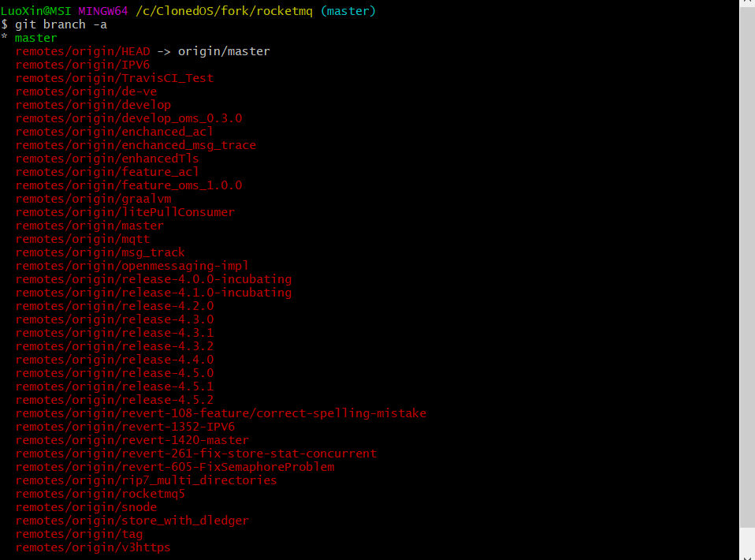

```shell
git branch -r
```

查看远程版本库上的分支列表，加上 `-d` 参数可以删除远程版本库上的分支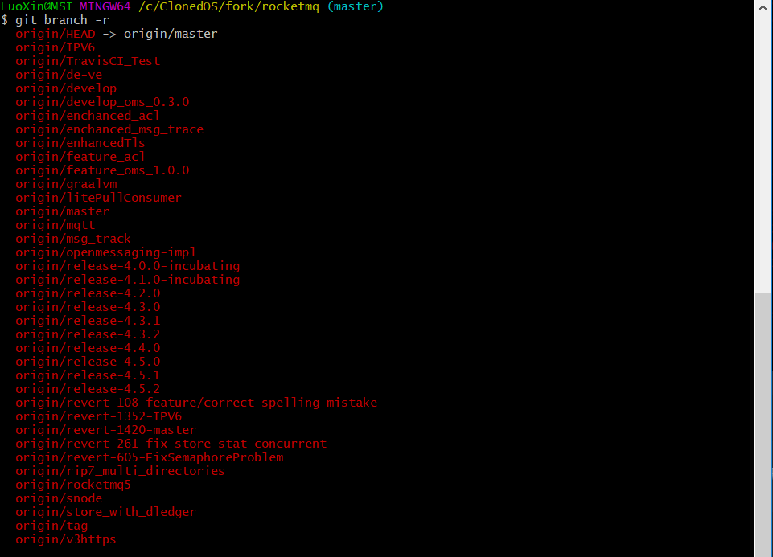

```shell
git branch -D
```

分支未提交到本地版本库前强制删除分支

```shell
git branch -vv
```

查看带有最后提交id、最近提交原因等信息的本地版本库分支列表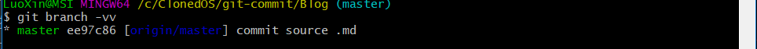

#### git merge

> 将其它分支合并到当前分支

```shell
git merge --squash
```

将待合并分支上的 `commit` 合并成一个新的 `commit` 放入当前分支，适用于待合并分支的提交记录不需要保留的情况，适用于将主分支内容merge回分分支。**一般使用不到**。

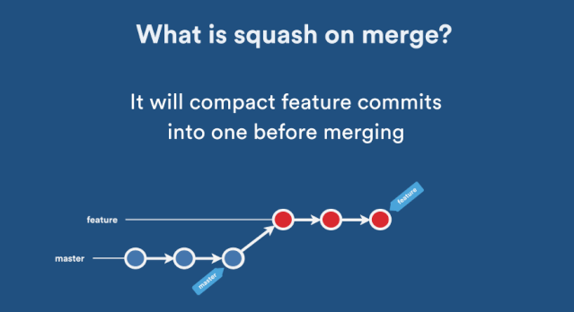

```shell
git merge --no-ff
```

默认情况下，`Git` 执行"`快进式合并`"（fast-farward merge），会直接将 `Master` 分支指向 `Develop` 分支，使用 `--no-ff` 参数后，会执行正常合并，在 `Master` 分支上生成一个新节点，保证版本演进更清晰。**推荐使用**。

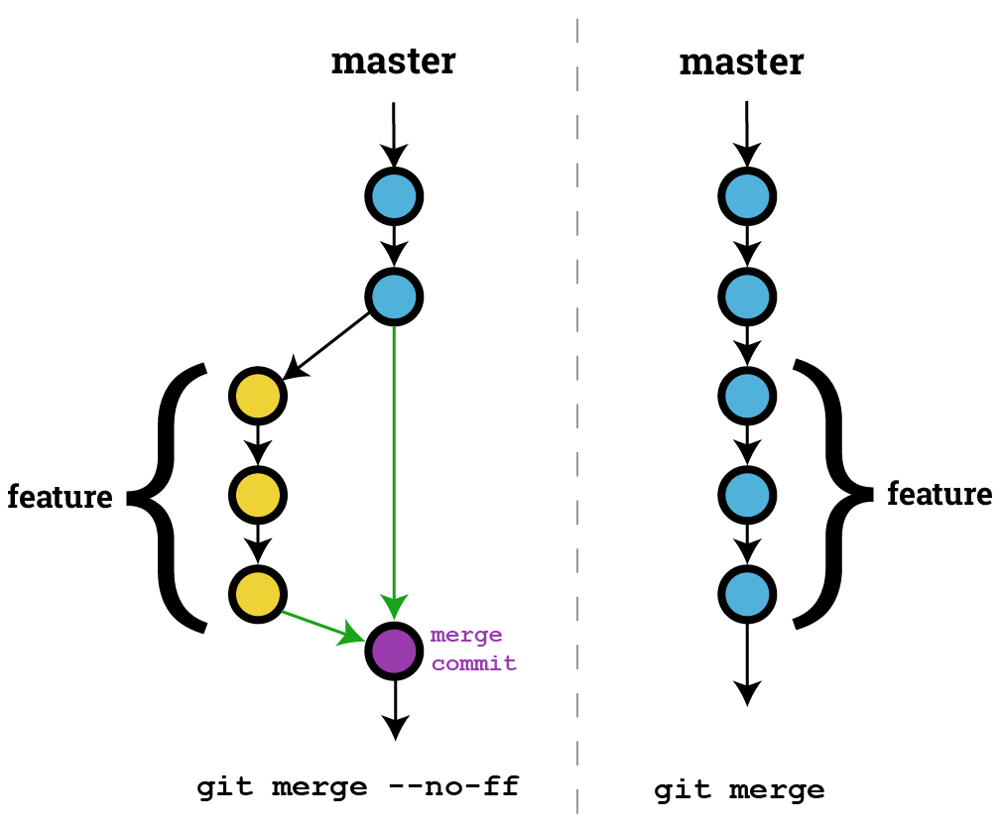
  

```shell
git merge --no-edit
```

在没有冲突的情况下合并，不想手动编辑提交原因，而是用 `Git` 自动生成的类似 `Merge branch 'test'`的文字直接提交，**不推荐使用**。

#### git checkout

> 切换分支

```shell
git checkout -b [分支名]
```

创建 `[分支名]` 分支，同时切换到这个新创建的分支

```shell
git checkout HEAD [文件名]
```

从本地版本库的 `HEAD`（也可以是提交ID、分支名、Tag名） 历史中检出 `[文件名]` 覆盖当前工作区的文件，如果省略 `HEAD` 则是从暂存区检出

```shell
git checkout --orphan new_branch名
```

这个命令会创建一个全新的，完全没有历史记录的新分支，但当前源分支上所有的最新文件都还在，真是强迫症患者的福音，但这个新分支必须做一次 `git commit` 操作后才会真正成为一个新分支。

```shell
git checkout -p other_branch
```

这个命令主要用来比较两个分支间的差异内容，并提供交互式的界面来选择进一步的操作，这个命令不仅可以比较两个分支间的差异，还可以比较单个文件的差异。

#### git stash

> 在 `Git` 的栈中保存当前修改或删除的工作进度，当你在一个分支里做某项功能开发时，接到通知把昨天已经测试完没问题的代码发布到线上，但这时你已经在这个分支里加入了其它未提交的代码，这个时候就可以把这些未提交的代码存到栈里。***stash命令正常开发中，使用频率不大。***

```shell
git stash
```


将未提交的文件保存到Git栈中

```shell
git stash list
```

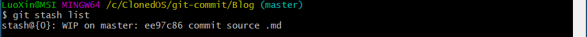

查看栈中保存的列表

```shell
git stash show stash@{0}
```

显示栈中其中一条记录

```shell
git stash drop stash@{0}
```

移除栈中其中一条记录

```shell
git stash pop
```

从Git栈中检出最新保存的一条记录，并将它从栈中移除

```shell
git stash apply stash@{0}
```

从Git栈中检出其中一条记录，但不从栈中移除

```shell
git stash branch new_banch
```

把当前栈中最近一次记录检出并创建一个新分支

```shell
git stash clear
```

清空栈里的所有记录

```shell
git stash create 
```

为当前修改或删除的文件创建一个自定义的栈并返回一个ID，此时并未真正存储到栈里

```shell
git stash store xxxxxx
```

将 `create` 方法里返回的ID放到 `store` 后面，此时在栈里真正创建了一个记录，但当前修改或删除的文件并未从工作区移除

```shell
$ git stash create 09eb9a97ad632d0825be1ece361936d1d0bdb5c7  （创建自定义栈，但没有储存）
$ git stash store 09eb9a97ad632d0825be1ece361936d1d0bdb5c7   （储存）
$ git stash list                                             （查看）
  stash@{0}: Created via "git stash store".
```

### 操作历史

#### git log

> 显示提交历史记录

```shell
git log -p
```

显示带提交差异对比的历史记录，分页的时候，按`空格`翻页。

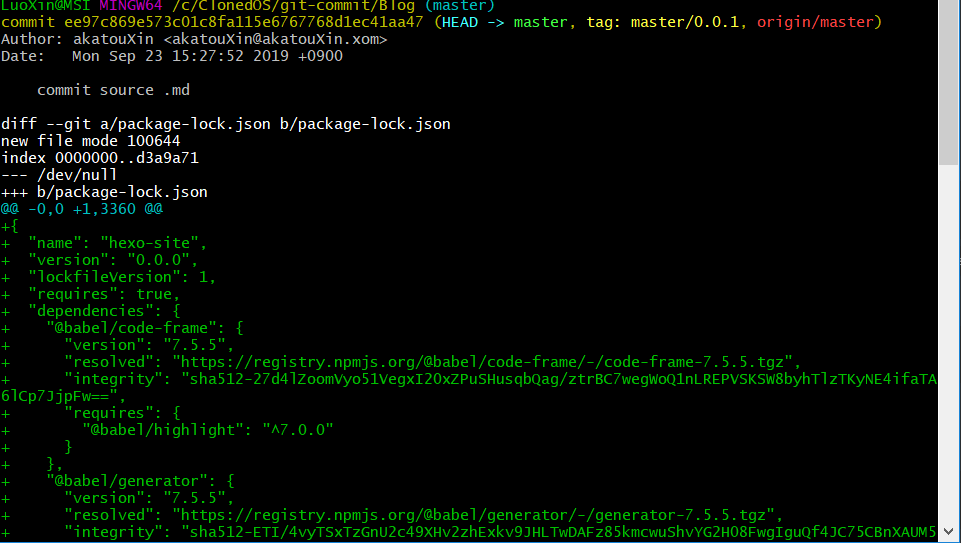

```shell
git log [具体文件名]
```

显示 `具体文件` 文件的历史记录

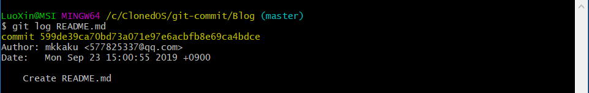

```shell
git log --since="2 weeks ago"
```

显示2周前开始到现在的历史记录，其它时间可以类推

```shell
git log --before="2 weeks ago"
```

显示截止到2周前的历史记录，其它时间可以类推

```shell
git log -10
```

显示最近10条历史记录

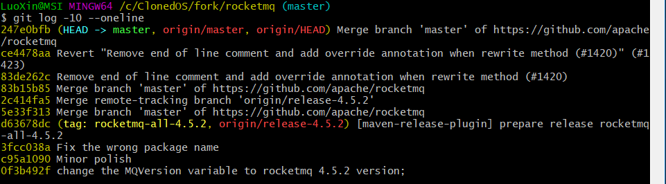

```shell
git log f5f630a..HEAD
```

显示从提交ID `f5f630a` 到 `HEAD` 之间的记录，`HEAD` 可以为空或其它提交ID

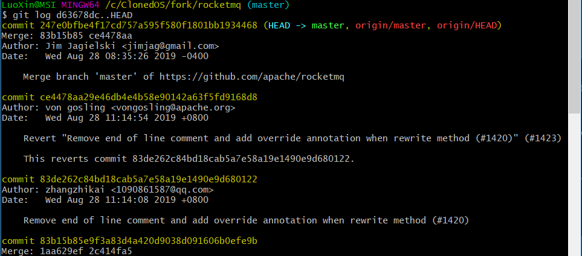

```shell
git log --pretty=oneline
```

在一行中输出简短的历史记录

```shell
git log --pretty=format:"%h" 
```

格式化输出历史记录

`Git` 用各种 `placeholder` 来决定各种显示内容，我挑几个常用的显示如下：

- %H: commit hash
- %h: 缩短的commit hash
- %T: tree hash
- %t: 缩短的 tree hash
- %P: parent hashes
- %p: 缩短的 parent hashes
- %an: 作者名字
- %aN: mailmap的作者名
- %ae: 作者邮箱
- %ad: 日期 (--date= 制定的格式)
- %ar: 日期, 相对格式(1 day ago)
- %cn: 提交者名字
- %ce: 提交者 email
- %cd: 提交日期 (--date= 制定的格式)
- %cr: 提交日期, 相对格式(1 day ago)
- %d: ref名称
- %s: commit信息标题
- %b: commit信息内容
- %n: 换行

#### git cherry-pick

> 合并分支的一条或几条提交记录到当前分支末梢，***不常用***

```shell
git cherry-pick 170a305
```

合并提交ID `170a305` 到当前分支末梢

#### git rebase

> 重新定义分支的版本库状态

```shell
git rebase branch_name
```

合并分支，这跟 `merge` 很像，但还是有本质区别，看下图：（**最终版本中，历史记录中排序不一样**）

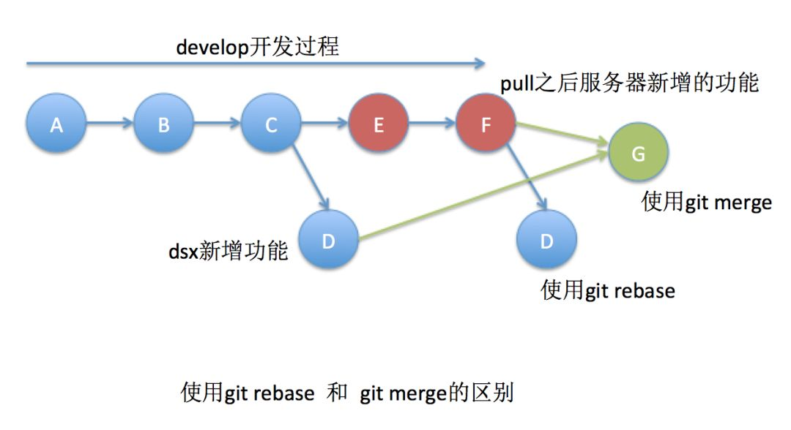

合并过程中可能需要先解决冲突，然后执行 `git rebase --continue`

#### git diff

> 查看工作区、暂存区、本地版本库之间的文件差异，用一张图来解释

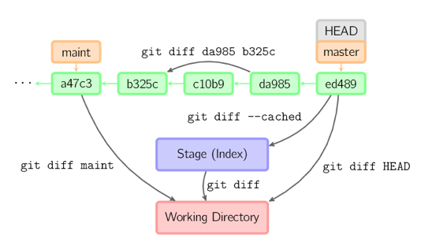

```shell
git diff --stat
```

通过 `--stat` 参数可以查看变更统计数据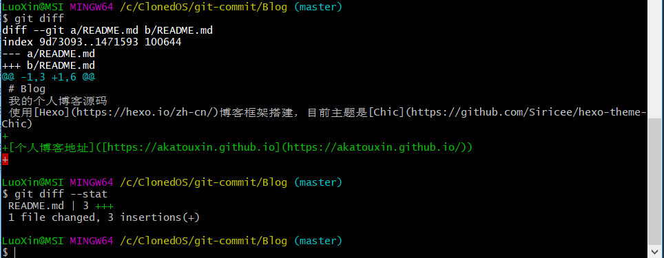

### 远程版本库连接

如果在GitHub项目初始化之前，文件已经存在于本地目录中，那可以在本地初始化本地版本库，再将本地版本库跟远程版本库连接起来

#### git init

> 在本地目录内部会生成.git文件夹

#### git remote

```shell
git remote -v
```

不带参数，列出已经存在的远程分支，加上 `-v` 列出详细信息，在每一个名字后面列出其远程url

```shell
git remote add origin https://github.com/akatouXin/Blog.git
```

添加一个新的远程仓库，指定一个名字，以便引用后面带的URL，可以表示把`本地仓库`与`远程仓库`建立联系。

#### git fetch

> 将远程版本库的更新取回到本地版本库

```shell
git fetch origin develop_RB
```

默认情况下，`git fetch` 取回所有分支的更新。如果只想取回特定分支的更新，可以指定分支名。`git fetch`只是同步了本地仓库与远程仓库，工作区没有变化。工作区要想同步，需要通过切换分支`git checkout `和拉取代码`git pull`

### 问题排查

#### git blame

> 查看文件每行代码块的历史信息

```shell
git blame -L 1,10 demo.html
```

截取 `demo.html` 文件1-10行历史信息

#### git bisect

> 二分查找历史记录，排查BUG

```shell
git bisect start
```

开始二分查找

```shell
git bisect bad
```

标记当前二分提交ID为有问题的点

```shell
git bisect good
```

标记当前二分提交ID为没问题的点

```shell
git bisect reset
```

查到有问题的提交ID后回到原分支

### 更多操作

#### git submodule

> 通过 Git 子模块可以跟踪外部版本库，它允许在某一版本库中再存储另一版本库，并且能够保持2个版本库完全独立

```shell
git submodule add https://github.com/akatouXin/akatouxin.github.io.git public
```

将 `demo` 仓库添加为子模块

```shell
git submodule update public
```

更新子模块 `demo`

#### git gc

> 运行Git的垃圾回收功能，清理冗余的历史快照

#### git archive

> 将加了tag的某个版本打包提取

```
git archive -v --format=zip v0.1 > v0.1.zip
```

`--format` 表示打包的格式，如 `zip`，`-v` 表示对应的tag名，后面跟的是tag名，如 `v0.1`。

## 总结

本文只是对 `Git` 的所有功能中的部分实用功能做了一次探秘，Git非常强大，还有很多功能有待我们去发现，限于本文篇幅，咱就此打住吧，预知更多好用功能，请善用谷歌。

## 参考资料

> - Git官方的[Git Pro](https://git-scm.com/book/en/v2)电子书
> - [Git Doc](https://git-scm.com/docs)
> - [Git 教程](https://www.runoob.com/git/git-tutorial.html)| 菜鸟教程