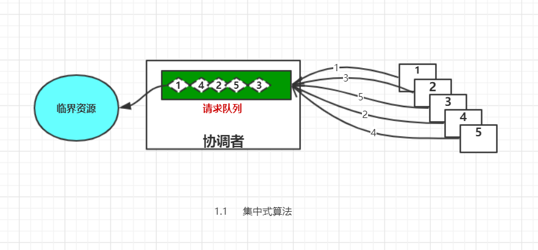
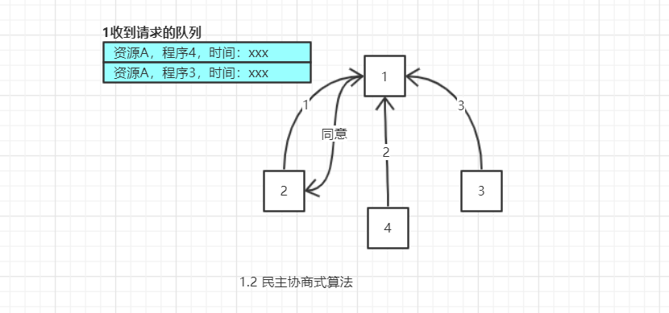
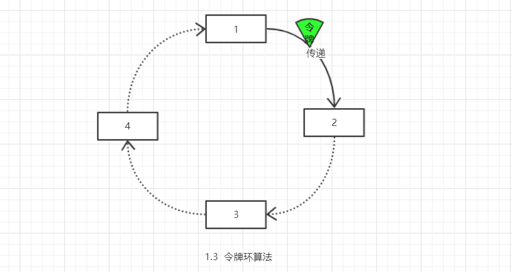
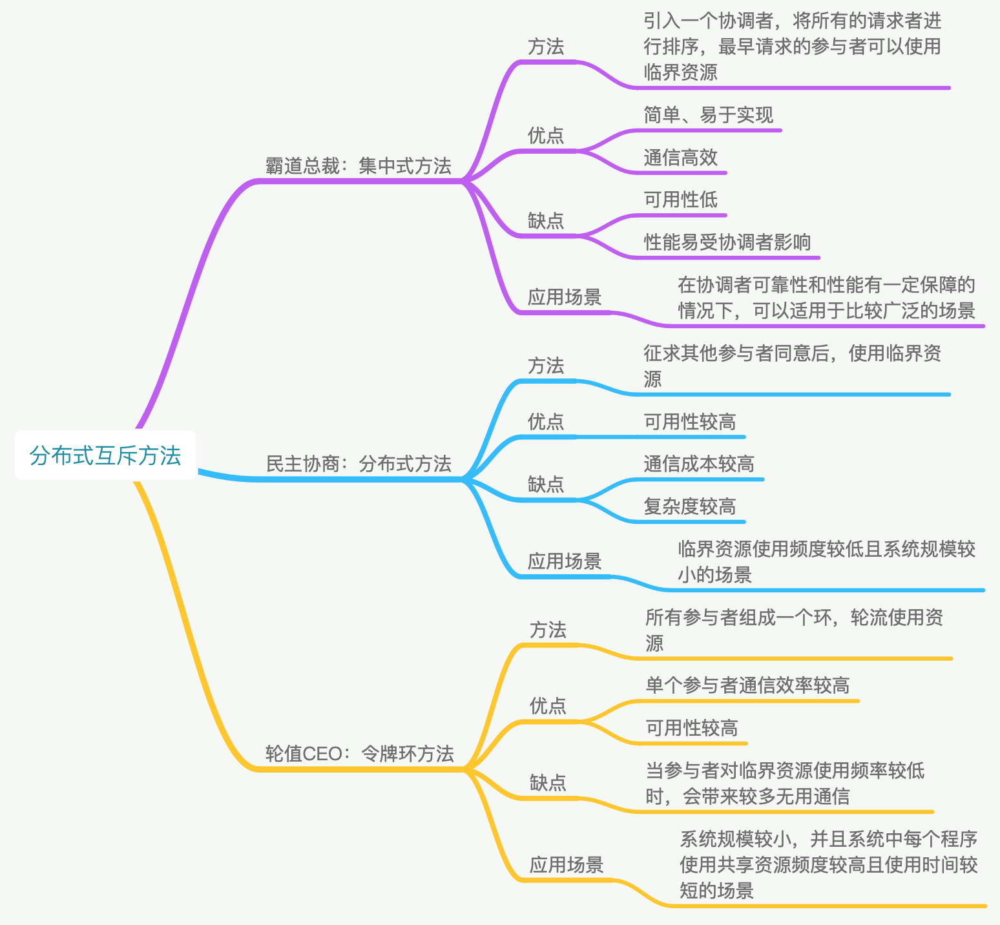

# 分布式协调与同步——分布式互斥

## 什么是分布式互斥

在分布式系统中，对于同一个共享资源，同一个时刻只能有一个程序使用，这种排他式资源访问方式，叫做分布式互斥（Distributed Mutaual Exclusion），而被分布式互斥访问的资源又叫做临界资源（Critical Resource）。

## 怎么样实现——互斥算法

### 集中式算法

又叫中央服务器算法。通过给分布式系统访问临界资源时，引入一个“`协调者`”程序的方式，得到一个分布式互斥算法。当有程序要去访问临界资源的时候，需要先去询问协调者，由协调者判断是否可以访问。这一点类似于并发下多线程对锁的竞争。协调者根据情况进行判断，如果这一时刻没有其他程序访问临界资源，则允许访问；如果有其他程序在访问，就给当前程序进行排队，一旦临界资源被访问完毕，协调者就从队伍中取出最前面的程序请求，给它访问权限。

**优点**：简单，直观，易实现；各程序间不需要互相访问。

**缺点**：容易引发单点故障（协调者）；协调者容易成为系统性能瓶颈。

总而言之，单选用集中式算法时，一定要选用**性能好**，**可靠性高**的服务器。或者中央服务器需要做**主从配置**，一旦主机故障，从机立马抵上。

### 分布式算法

既然集中式的总裁算法容易引起单点故障，那么是否可以通过不要协调者，而是各个程序通过协商的方式来内部商讨谁来访问临界资源？但一个程序要想访问临界资源的时候，给每个其他程序批量发送询问消息——“我可以使用临界资源吗？”，在收到其他程序的全部同意消息返回时，才可以去访问临界资源。其他程序在收到请求消息的时候，如果自己不在使用或者即将使用（已经发出请求信息），则返回同意消息；反之，等自己使用完毕才返回同意消息。（利用队列来维护收到的请求）

请求消息需要包含所请求的资源、请求者的 ID，以及发起请求的时间戳。

这就是民主协商的分布式算法，或者称为使用了组播和逻辑时钟的算法。

**优点**：简单易懂，易实现；

**缺点**：各程序间需要知道彼此的通信地址；当分布式系统组件增多的时候，容易产生“指令风暴”，即程序处理指令的时间比自身业务还要多，加大了系统资源开销；一个程序出现故障，无法回复信息，其他程序处于等待信息状态，整个系统会出现停滞。

针对缺点，可以做改进，当系统规模比较大的时候，可以引入一个`注册中心`，当程序上线的时候去注册中心注册自己，并且一定间隔更新自己的状态，当一个程序需要访问临界资源的时候，先去注册中心获取其他程序的地址以及状态，预先发送一条检测信息，<u>当检测到一个程序出现异常的时候，则忽略，不发出请求</u>；如果规模比较小可以考虑不引入注册中心，直接配置组件间地址。

这个算法**适用于系统节点比较少且变动不频繁，且各个程序需要互相通信，适合p2p系统**；典型的有分布式文件系统HDFS的文件修改。

### 令牌环算法

互斥算法中除了集中式，分布式算法，是否还有其他算法？答案是肯定的，比较方法总比问题多。华为独创的轮值CEO其实给我们提供了思路。CEO可以看作是临界资源，每次只有一个人可以当（访问）。那么，在分布式互斥场景中，是否可以考虑引入一个“CEO令牌”，然后在各程序间按照一定顺序传递，拿到令牌的程序先判断自己是否需要访问资源，不是的话传递给下一个，反之，先自己访问资源然后再传递给下一个。

**优点**：公平；通信回数少；稳定性高。

**缺点**：非实时，需要等令牌传的手上才能访问。

令牌环算法适用于**系统规模小，临界资源访问频繁但访问速度快时间短**的系统。

### 多层令牌环算法

其实上面提到的三种算法都不适用于系统规模大的分布式中，那么是否有一种算法可以对应大规模系统呢？实际上，当大规模系统需要访问临界资源的场景下，首先需要做的是临界资源的拆分，因为无论出于哪种考虑，大规模系统同时访问以临界资源，本身就是一个不合理的事情；如果非要说实际上就是这样，那么可以考虑采用多层令牌环的算法。

多层令牌环和单层令牌环本质上没有多少区别，就是小规模系统的单层令牌在大规模系统中的应用，将大系统分而治之，根据预先设定的规则，拆分成小系统，每个小系统都采用令牌环，总的系统只用一个令牌，从大系统到小系统依次传递。

## 一图论之

## 