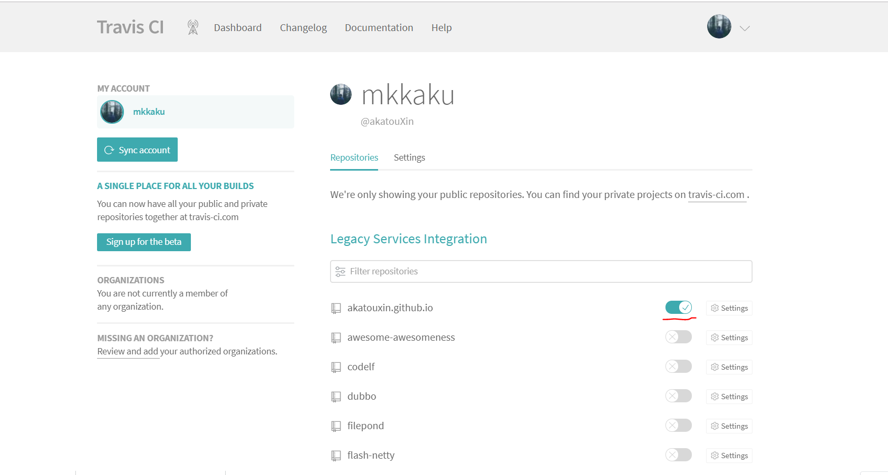
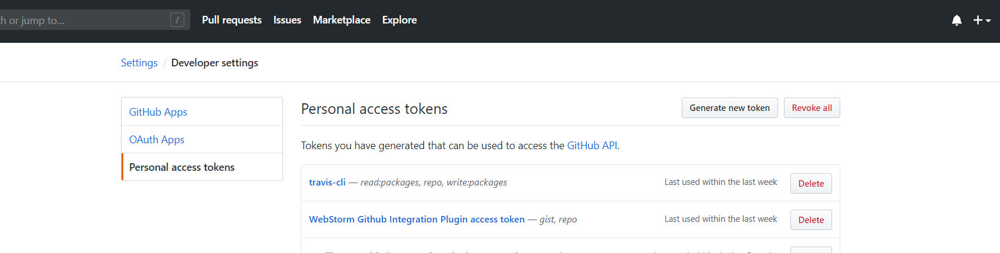
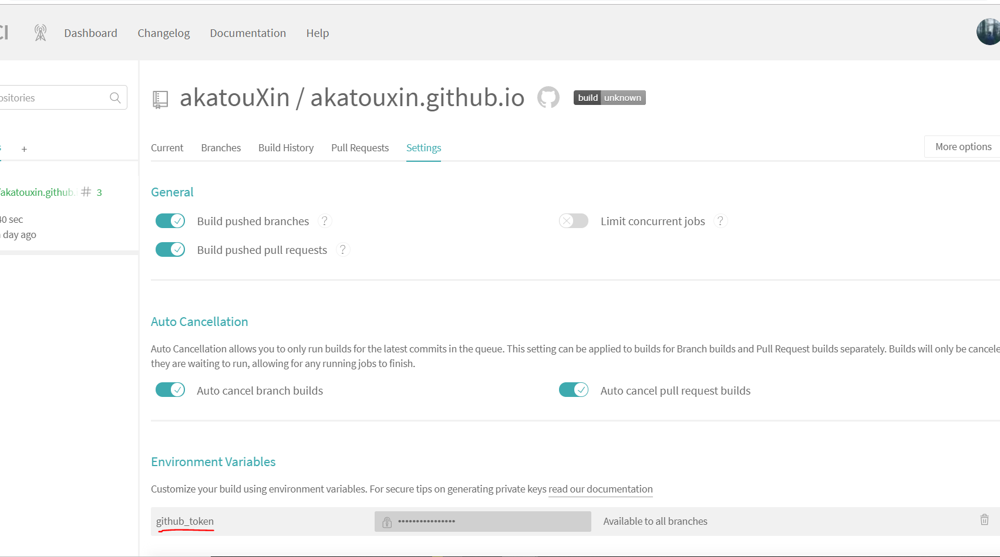
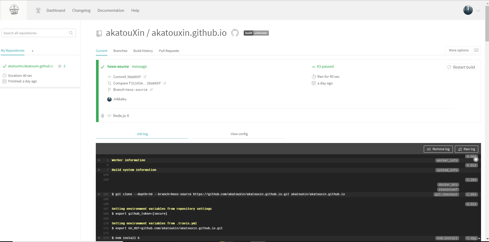

# 利用Travis-ci部署Github静态博客

## 何为Travis-ci

[Travis CI]([https://www.travis-ci.org](https://www.travis-ci.org/)) 是目前新兴的开源持续集成构建项目，它与`Jenkins`，`GO`的很明显的特别在于采用`yaml`格式，同时他是个在线的服务，不像jenkins需要你本地架设服务器，简洁清新独树一帜。目前大多数的github项目都已经移入到Travis CI的构建队列中，据说Travis CI每天运行超过万次完整构建。对于做开源项目或者github的使用者，将项目加入travis ci是个不错的选择。

## 预到目标

使用`Hexo`搭建托管在`Github`上的个人博客,每次本地写完，本地编译以后推送到Github，但是随着博客数量的增大，本地编译花费的时间越来越大，所以一开始想着是否可以利用`Webhook`机制来通知另一台服务器自行编译部署。但是随之而来的问题是需要另一台服务器，又增加了成本。后来了解到Travis ci，在博客根目录配置好Travis ci以后，每当把博客的源码推送到仓库特定分支以后，会由Github来通知Travis ci来编译并且部署。

##　如何配置

### 配置Github和Travs ci

1 在`Travis Ci`用`Github`账号登陆以后，会看见自己已经托管在`Github`的仓库，开启博客仓库。

2 在`Github`生成`access token`，并在`Travi ci`的环境变量`Env`中填好token，值得注意的是，**在github创建access token的时候，需要记下这个token，因为一旦创建之后是不能看见的，如果没记下，那就需要重新创建了**。





这样一来。Travis中的`github_token`就可以在Travis脚本中以环境变量的形式直接引用。

### 创建.travis.yml配置脚本

在travis ci中，所有行为都是由一个被放在仓库根目录的`.travis.yml`的配置文件所控制。具体可以查看[Travis document](https://docs.travis-ci.com/)

```yaml
# 语言环境
language: node_js
node_js: 6

# S: Build Lifecycle
install:
  - npm install

script:
  - hexo g
# 具体的编译部署shell
after_script:
  - cd ./public
  - git init
  - git config user.name "akatou"
  - git config user.email "akatou@akatou.com"
  - git add .
  - git commit -m "edit/deploy"
  - git push --force --quiet "https://${github_token}@${GH_REF}" master:master

# travis控制的分支
branches:
  only:
    - hexo-source
env:
  global:
    - GH_REF: github.com/akatouXin/akatouxin.github.io.git
```

其中`${github_token}`就是刚刚在travi中创建的环境变量名。

## 运行流程

Travis 的运行流程很简单，任何项目都会经过两个阶段。

> - install 阶段：安装依赖
> - script 阶段：运行脚本

###  install 字段

`install`字段用来指定安装脚本。

```yaml
install: npm install
```

如果有多个脚本，可以写成下面的形式。

```yaml
install:
  - command1
  - command2
```

上面代码中，如果`command1`失败了，整个构建就会停下来，不再往下进行。

如果不需要安装，即跳过安装阶段，就直接设为`true`。

```yaml
install: true
```

### script 字段

`script`字段用来指定构建或测试脚本。

```yaml
script:   - hexo g
```

如果有多个脚本，可以写成下面的形式。

```yaml
script:
  - command1
  - command2
```


注意，`script`与`install`不一样，如果`command1`失败，`command2`会继续执行。但是，整个构建阶段的状态是失败。

如果`command2`只有在`command1`成功后才能执行，就要写成下面这样。

```yaml
script: command1 && command2
```


更多设置请看[官方文档](https://docs.travis-ci.com/user/languages/javascript-with-nodejs/)。

###  部署

`script`阶段结束以后，还可以设置[通知步骤](https://docs.travis-ci.com/user/notifications/)（notification）和[部署步骤](https://docs.travis-ci.com/user/deployment/)（deployment），它们不是必须的。

部署的脚本可以在`script`阶段执行，也可以使用 Travis 为几十种常见服务提供的快捷部署功能。比如，要部署到 [Github Pages](https://docs.travis-ci.com/user/deployment/pages/)，可以写成下面这样。

```yaml
deploy:
  provider: pages
  skip_cleanup: true
  github_token: $github_token # Set in travis-ci.org dashboard
  on:
    branch: master
```


其他部署方式，请看[官方文档](https://docs.travis-ci.com/user/deployment/)。

###  钩子方法

Travis 为上面这些阶段提供了7个钩子。

> - before_install：install 阶段之前执行
> - before_script：script 阶段之前执行
> - after_failure：script 阶段失败时执行
> - after_success：script 阶段成功时执行
> - before_deploy：deploy 步骤之前执行
> - after_deploy：deploy 步骤之后执行
> - after_script：script 阶段之后执行

完整的生命周期，从开始到结束是下面的流程。

> 1. before_install
> 2. install
> 3. before_script
> 4. script
> 5. after*success or after*failure
> 6. [OPTIONAL] before_deploy
> 7. [OPTIONAL] deploy
> 8. [OPTIONAL] after_deploy
> 9. after_script

下面是一个`after_script`钩子的例子。

```yaml
after_script:
  - cd ./public
  - git init
  - git config user.name "akatou"
  - git config user.email "akatou@akatou.com"
  - git add .
  - git commit -m "edit/deploy"
  - git push --force --quiet "https://${github_token}@${GH_REF}" master:master
```


### 运行状态

最后，Travis 每次运行，可能会返回四种状态。

- passed：运行成功，所有步骤的退出码都是`0`
- canceled：用户取消执行
- errored：`before_install`、`install`、`before_script`有非零退出码，运行会立即停止
- failed ：`script`有非零状态码 ，会继续运行

## 查看Travis运行log



