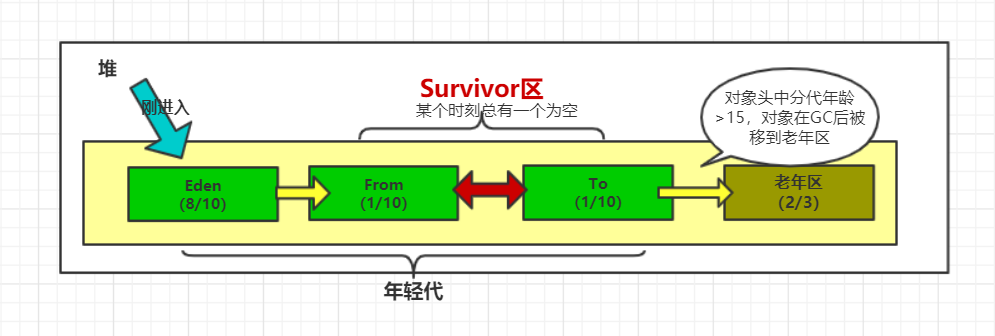

# 浅尝「JVM虚拟机底层原理」ーJVM内存模型

<!--本节讲述的是java虚拟机内存模型，不是java内存模型（JMM/java线程内存模型）-->

## JVM内存模型

Java虚拟机在执行Java程序的过程中会把它所管理的内存划分为若干个不同的数据区域：

在**jdk1.8**及其以后，`方法区`（永代区）已经被`元空间`代替，并把`元空间`移到本地内存，原方法区的`常量池`被移到`堆内存`中。

JVM运行时数据区域总得来说，可以被分为：`程序计数器`，`栈`，`堆`，`本地方法栈`，`方法区`等。

### 程序计数器

较小的内存空间，是当前线程执行的字节码的行号指示器；各线程之间独立存储，互不影响。

### 栈

准确的说，更应该被称为`线程栈`，也有叫做java栈。从名字上可以看出，栈是`线程私有`的，每个线程对应一个栈，从数据结构上来说，栈是`先进后出（FILO）`；线程在运行的时候，线程中每个`方法`会被打包成一个`栈帧`，由方法先后执行顺序，把每个栈帧按照先后顺序压入栈；从线程内代码自上而下的执行顺序上看，后执行的方法（块）先结束，所以，后入栈的栈帧先出栈，这也是符合代码逻辑的；`栈随着线程的结束而消亡`，不需要GC来回收，资源效率比堆高，大小也远小于堆内存，jvm缺省的时候为1m。

栈内结构比较复杂，总的可以分成：`局部变量表`，`操作数栈`，`动态链接`，`方法出口`等区域。

> **局部变量表**：用来存放`方法参数`和方法内部定义的`局部变量`，局部变量表是有`索引`的，索引`0`指得就是`this`，方法本身。当那些是被new方法创建出来的对象实例是，实例是存放在堆内存中，而在栈内存中保留的就是指向这个实例的`指针`（ref）。
>
> **操作数栈**：局部变量赋值过程中，用来暂存数据的区域。可以结合Javap -c xxxx.class 来查看字节码→汇编时的jvm指令，其中数据与变量之间的赋值过程，数据的入栈出栈就是在操作数栈。
>
> **动态链接**： 一个方法调用另一个方法，或者一个类使用另一个类的成员变量时，发生的符号引用或者直接引用，这一引用过程被称为动态链接。
>
> **方法出口**：当上一个方法调用JVM的return指令时，程序计数器会记录该返回值会给谁，即下一步会执行什么方法（栈帧），方法出口就是指向的下一个方法的字节码的行号，这个值会被程序计数器记录，所以说，每个栈都有自己的程序计数器，并且互不干扰。

### 堆

堆内存是JVM性能优化的关键区域。划分为`年轻代（新生代）`(1/3)和`老年区`(2/3)；年轻代又被划分为`eden`(8/10)，`survivor`区(2/10)，S区进而被划分为`From`(1/2)，`TO`(1/2)两个区域。

#### 两个GC

##### a. minor GC

minor GC，俗称小GC

> 触发条件：当`伊甸园`（Eden）区满的时候被触发。
>
> 回收过程：GC回收器收集Eden和From/To区域中有引用的对象，将这些对象的`分代年龄+1`，`复制`到To/From区（如果分代年龄>15，复制到老年区），并销毁Eden和From/To区中`无引用不可达`对象。（涉及到垃圾回收算法/策略，请查看这里）

##### b. full GC

full GC，俗称大GC，GC时`STW`,即`stop to work`,会将程序所有线程stop，腾出cpu来执行GC，这个情形下，程序是`无响应，堵塞`状态。

> 触发条件：当`老年区`满的时候被触发。
>
> 回收过程：GC回收器收集整个堆内存区域中`无引用不可达`对象，然后销毁这些`流离态`对象（涉及到垃圾回收算法/策略，请查看这里）

JVM怎么判断无引用不可达？即什么是不可达算法？

> 不可达算法简而言之就是探测*GC Root根是否存在。存在即可达，不存在即不可达*。

什么是GC Root根？

> GC Root根就是指：`栈的私有对象`，方法区的`静态变量对象`等。
>
> 堆内对象是由栈的局部变量，方法区的静态变量`New`出来的。堆内的对象实例的`引用源头`就称作`GC Root根`。当GC执行的时候，会查找所有栈·方法区中存在的对象引用（ref）指向的堆内存对象（地址），并由引用对象开始`递归`往下查找引用对象的引用对象，并记录下来成为`引用链`，最终在这些引用链以外的存活对象，就是不可达对象，理应被回收。

### 本地方法栈

也被称为`本地方法区`。本地方法栈保存的是`native`方法的信息，当一个JVM创建的线程调用native方法后，JVM不再为其在虚拟机栈中创建栈帧，JVM只是简单地动态链接并直接调用`native`方法。

> 本地方法是什么？
>
> 总所周知，java脱胎于C/C++，在现行的java虚拟机中，存在着大量的C/C++体系的代码调用，这些代码可能是操作系统的底层代码。在jdk中，那些带有native关键字的方法，并没有具体的方法实现，其实这些就是本地方法，具体实现是由操作系统底层C/C++代码去实现的。
>
> ```java
> //jdk 线程类
> public class Thread implements Runnable {
>     /**
>      * Returns a reference to the currently executing thread object.
>      *
>      * @return  the currently executing thread.
>      */
>     public static native Thread currentThread();
> }
> ```

### 方法区

也叫永久代，用于存储已经被虚拟机加载的类的元信息，常量 （池），静态变量(static修饰)等数据（-XX:PermSize；XX:MaxPermSize；-XX:MetaspaceSize； XX:MaxMetaspaceSize ）。在JVM历史上，在jdk1.7时，常量被从方法区移到了堆中（可以理解为池化，最终应该是在堆的老年区），然后在jdk1.8的时候，方法区改名为元空间（metaspace），并且被移出java虚拟机运行时数据体系，直接到本地内存区域。

> 为什么？
>
> 永久代来存储类信息、常量、 静态变量等数据不是个好主意, 在代码量很大的情况下，很容易遇到连代码都没有加载完就内存溢出的问题。（永久代也是要占内存的）
> 由于永久代中静态变量有可能是new对象，所以会把实例存在堆内存中，而GC监控的就是堆内存，由此导致，永久代与堆内存的不完全隔离，而对永久代进行调优是很困难的, 所以需要同时将元空间与堆的垃圾回收进行了隔离，避免永久代引发 的Full GC和OOM等问题；

### 直接内存

不是虚拟机运行时数据区 的一部分，也不是java虚拟机规范中定 义的内存区域，但`元空间`在直接内存中，`堆`内实例对象中，在对象头信息中会储存了`类对象的信息`（指针），指向元空间，所以堆和直接内存是有`引用关系`的。

其次，如果使用了NIO,这块区域会被频繁使用，在java堆内可以用 `directByteBuffer`对象直接引用并操作；虽然这块内存不受java堆大小限制，但受本机总内存的限制,可以通过` MaxDirectMemorySize`来设置（默认与堆内存最大值一样），所以也会出现`OOM`异常。