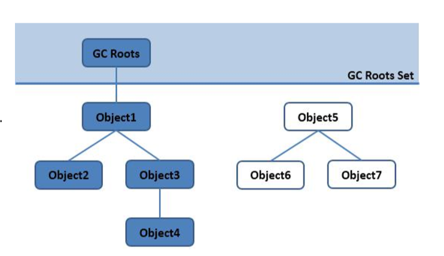
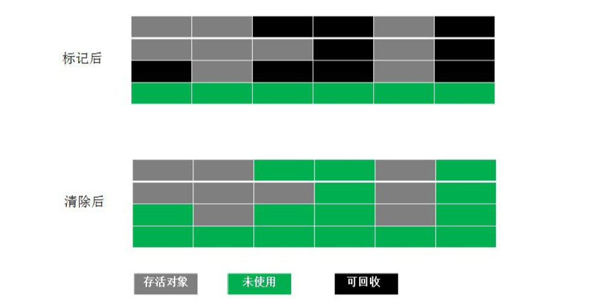
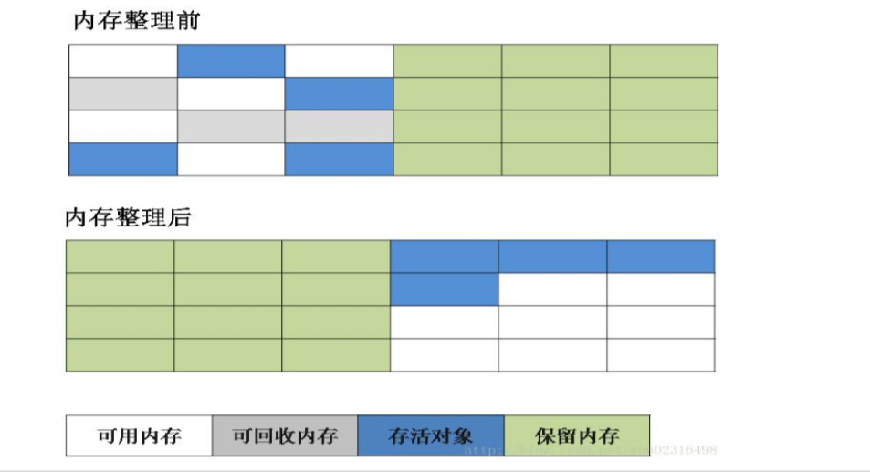
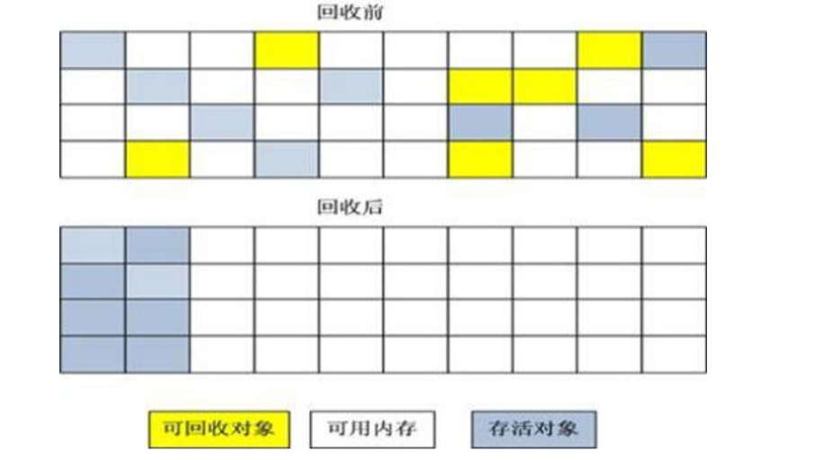

# 浅尝「JVM的GC机制」ーGC与内存分配策略

## 从如何区分GC对象说起

### 引用计数算法 

顾名思义，就是如果一个对象被另一个对象正在引用，则引用计数＋１，如果被另一个对象解除引用关系，则计数－1，当GC的时候，引用计数=0的那些对象就应该被GC了。

- 优点：简单，易理解。
- 缺点：存在互相引用，会造成永驻。这个就类似于死锁的概念，A引用B，B引用A，各自计数为1，但实际上，AB存在没有意义，消耗内存。
- 应用：这一种算法，虽然存在致命的缺点，但是在早期的Windows系统和Doc系统中被使用。

### 可达性分析

#### GC Root根

在Java中，可以被当作GC Root根的有：统称GC Roots Set

- 方法区: 类静态属性引用的对象; 
- 方法区: 常量引用的对象; 
- 虚拟机栈(局部变量表)中引用的对象. 
- 本地方法栈JNI(Native方法)中引用 的对象

JVM的垃圾回收器，会从上记四个地方的对象开始分析（统计学上，绝大多数还是栈上的局部变量表开始），依次找到引用的对象，并递归寻找，找到引用的引用，依次一直找到最后一个对象，这样就行成完整的引用关系链/网。在这个集合（Object1，Object2，Object3，Object4）以外的都是流离对象（Object5，Object6，Object7），应该被GC。

实际中，即使在可达的引用对象，也有可能会被GC回收的。这就要看这个对象的引用时什么引用了。

#### 引用分类

##### 强引用

一般的Object obj = new Object() ，就属于强引用。

##### 软引用 SoftReference

一些有用但是并非必需，用软引用关联的对象（由SoftReference对象封装），系统将要发生OOM之前，这些对象就会被回收。参见代码：

##### 弱引用 WeakReference

一些有用（程度比软引用更低）但是并非必需，用弱引用关联的对象（由WeakReference对象封装），只能生存到下一次垃圾回收之前，GC发生时，不管内存够不够，都会被回收。

##### 虚引用

也叫幽灵引用，最弱，被垃圾回收的时候收到一个通知

#### 简而言之

如果是强引用的话，那就是new对象的引用，它是完全的要看是否可达，可达不会被GC；

如果是软引用，在OOM之前的那次full GC的时候，即使可达也会被GC；

如果是弱引用，不管是否可达，在下一次GC一定会被GC；

虚引用，实际上没有可达的分析必要，（其存在的意义就是单纯的给GC一个通知，通知GC应该GC了）一定会被GC。

> 多种引用存在的意义
>
> 软引用 SoftReference和弱引用 WeakReference，可以用在内存资源紧张的情况下以及创建不是很重要的数据缓存。当系统内存不足的时候，缓存中的内容是可以被释放的。
>
> 例如，一个程序用来处理用户提供的图片。如果将所有图片读入内存，这样虽然可以很快的打开图片，但内存空间使用巨大，一些使用较少的图片浪费内存空间，需要手动从内存中移除。如果每次打开图片都从磁盘文件中读取到内存再显示出来，虽然内存占用较少，但一些经常使用的图片每次打开都要访问磁盘，代价巨大。这个时候就可以用软引用构建缓存。

## GC算法

### 标记-清除算法（Mark-Sweep）

该算法要点是：分为两个环节,标记，清除。首先标记出所有需要回收的对象，在标记完成后统一回收所有被标记的对象。

优点：简单明了。

缺点：造成内存碎片化。标记清除之后会产生大量不连续的内存碎片，空间碎片太多可能会导致以后在程序运行过程中需要分配较大对象时，无法找到足够的连续内存而不得不提前触发另一次垃圾收集动作。比如上图中，假设一个可写区域为1kb，如果要存储6kb以上的数据，会存不进去（连续划分），即使这时候可写为15kb的数据。

### 复制算法（Copying）

该算法的要点是：将内存区域划分成大小相等的两快，一次只使用其中一快，将另一快区域置空。当GC发生的时候，将存活对象依个Copy到另一个快中，并清空这快以便下次使用。

优点：避免了内存碎片化。只需要按顺序分配即可，规避了M-S算法的缺点。实现简单，运行高效。

缺点：造成内存浪费，因为某一时间内总是只有一块在使用。

### 标记-整理算法（Mark-Compact）

该算法的要点是：结合了上面两种算法的优点，首先标记出所有需要回收的对象，在标记完成后，后续步骤不是直接对可回收对象进行清理，而是让所有存活的对象都向一端移动（Copy），然后直接清理掉端边界以外的内存。

优点：避免碎片化，提高了内存使用效率。

缺点：性能相对较差，因为要做的事情三者中最复杂。

Java的GC策略