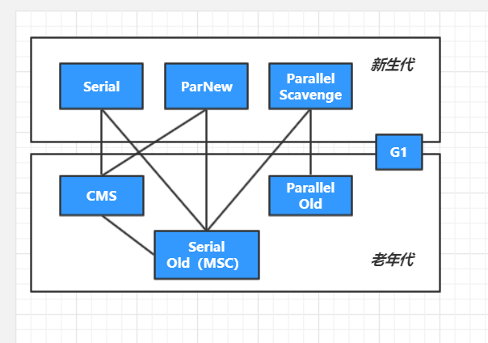

# 浅尝「JVM的GC机制」ーGC与内存分配策略

## 从如何区分GC对象说起

### 引用计数算法 

顾名思义，就是如果一个对象被另一个对象正在引用，则引用计数＋１，如果被另一个对象解除引用关系，则计数－1，当GC的时候，引用计数=0的那些对象就应该被GC了。

- 优点：简单，易理解。
- 缺点：存在互相引用，会造成永驻。这个就类似于死锁的概念，A引用B，B引用A，各自计数为1，但实际上，AB存在没有意义，消耗内存。
- 应用：这一种算法，虽然存在致命的缺点，但是在早期的Windows系统和Doc系统中被使用。

### 可达性分析

#### GC Root根

在Java中，可以被当作GC Root根的有：统称GC Roots Set

- 方法区: 类静态属性引用的对象; 
- 方法区: 常量引用的对象; 
- 虚拟机栈(局部变量表)中引用的对象. 
- 本地方法栈JNI(Native方法)中引用 的对象

JVM的垃圾回收器，会从上记四个地方的对象开始分析（统计学上，绝大多数还是栈上的局部变量表开始），依次找到引用的对象，并递归寻找，找到引用的引用，依次一直找到最后一个对象，这样就行成完整的引用关系链/网。在这个集合（Object1，Object2，Object3，Object4）以外的都是流离对象（Object5，Object6，Object7），应该被GC。

实际中，即使在可达的引用对象，也有可能会被GC回收的。这就要看这个对象的引用时什么引用了。

#### 引用分类

##### 强引用

一般的Object obj = new Object() ，就属于强引用。

##### 软引用 

SoftReference，一些有用但是并非必需，用软引用关联的对象（由SoftReference对象封装），系统将要发生OOM之前，这些对象就会被回收。参见代码：

##### 弱引用 

WeakReference，一些有用（程度比软引用更低）但是并非必需，用弱引用关联的对象（由WeakReference对象封装），只能生存到下一次垃圾回收之前，GC发生时，不管内存够不够，都会被回收。

##### 虚引用

也叫幽灵引用，最弱，被垃圾回收的时候收到一个通知

#### 简而言之

如果是强引用的话，那就是new对象的引用，它是完全的要看是否可达，可达不会被GC；

如果是软引用，在OOM之前的那次full GC的时候，即使可达也会被GC；

如果是弱引用，不管是否可达，在下一次GC一定会被GC；

虚引用，实际上没有可达的分析必要，（其存在的意义就是单纯的给GC一个通知，通知GC应该GC了）一定会被GC。

> 多种引用存在的意义
>
> 软引用 SoftReference和弱引用 WeakReference，可以用在内存资源紧张的情况下以及创建不是很重要的数据缓存。当系统内存不足的时候，缓存中的内容是可以被释放的。
>
> 例如，一个程序用来处理用户提供的图片。如果将所有图片读入内存，这样虽然可以很快的打开图片，但内存空间使用巨大，一些使用较少的图片浪费内存空间，需要手动从内存中移除。如果每次打开图片都从磁盘文件中读取到内存再显示出来，虽然内存占用较少，但一些经常使用的图片每次打开都要访问磁盘，代价巨大。这个时候就可以用软引用构建缓存。

## GC算法与分代收集

### 标记-清除算法（Mark-Sweep）

该算法要点是：分为两个环节,标记，清除。首先标记出所有需要回收的对象，在标记完成后统一回收所有被标记的对象。

优点：简单明了。

缺点：造成内存碎片化。标记清除之后会产生大量不连续的内存碎片，空间碎片太多可能会导致以后在程序运行过程中需要分配较大对象时，无法找到足够的连续内存而不得不提前触发另一次垃圾收集动作。比如上图中，假设一个可写区域为1kb，如果要存储6kb以上的数据，会存不进去（连续划分），即使这时候可写为15kb的数据。

### 复制算法（Copying）

该算法的要点是：将内存区域划分成大小相等的两快，一次只使用其中一快，将另一快区域置空。当GC发生的时候，将存活对象依个Copy到另一个快中，并清空这快以便下次使用。

优点：避免了内存碎片化。只需要按顺序分配即可，规避了M-S算法的缺点。实现简单，运行高效。

缺点：造成内存浪费，因为某一时间内总是只有一块在使用。

### 标记-整理算法（Mark-Compact）

该算法的要点是：结合了上面两种算法的优点，首先标记出所有需要回收的对象，在标记完成后，后续步骤不是直接对可回收对象进行清理，而是让所有存活的对象都向一端移动（Copy），然后直接清理掉端边界以外的内存。

优点：避免碎片化，提高了内存使用效率。

缺点：性能相对较差，因为要做的事情三者中最复杂。

### JavaGC的分代收集

当前商业虚拟机的垃圾收集都采用“分代收集”（Generational Collection）算法，在此算法中，把Java堆分为新生代和老年代，这样就可以根据各个年代的特点采用最适当的收集算法。

专门研究表明，新生代中的对象`98%`是“朝生夕死”的，所以并不需要按照1:1的比例来划分内存空间，而是将内存分为一块`较大的Eden空间`和`两块较小的Survivor空间`，每次使用Eden和其中一块Survivor[1]。当回收时，将Eden和Survivor中还存活着的对象一次性地复制到另外一块Survivor空间上，最后清理掉Eden和刚才用过的Survivor空间。HotSpot虚拟机默认Eden和Survivor的大小比例是`8:1`，也就是每次新生代中可用内存空间为整个新生代容量的90%（80%+10%），只有10%的内存会被“浪费”。当然，98%的对象可回收只是一般场景下的数据，我们没有办法保证每次回收都只有不多于10%的对象存活，当Survivor空间不够用时，需要依赖其他内存（这里指老年代）进行`分配担保（Handle Promotion）`。

在`新生代`中，每次垃圾收集时都发现有大批对象死去，只有少量存活，那就选用`复制算法`，只需要付出少量存活对象的复制成本就可以完成收集。而`老年代`中因为对象存活率高、没有额外空间对它进行分配担保，就必须使用`“标记—清理”`或者`“标记—整理”`算法来进行回收。

## 垃圾回收器

在JVM中，上述三种算法综合使用的分代收集的GC策略，由此也衍生出不少的垃圾回收器。

> 查看GC回收器：java -XX:+PringCommandLineFlags -version

### 新生代

| 收集器            | 收集对象和算法        | 收集器类型   | 说明                                            | 使用场景                                                     |
| :---------------- | :-------------------- | :----------- | :---------------------------------------------- | ------------------------------------------------------------ |
| Serial            | 新生代； 复制算法 | 单线程       | 进行垃圾回收的时候，必须挂起所有业务类线程，STW | 简单高效；内存不大的场景                                     |
| ParNew            | 新生代； 复制算法 | 并行的多线程 | ParNew是Serial的多线程版本                      | 搭配CMS的首选                                                |
| Parallel Scavenge | 新生代； 复制算法 | 并行的多线程 | 类似于ParNew，但更注重吞吐量                    | Server端多CPU的默认GC，主要适合后台运算不需要 太多交互的任务； |

> 吞吐量=运行用户代码时间/(运行用户代码时间+ 垃圾收集时间)
>
> 垃圾收集时间= 垃圾回收频率 * 单次垃圾回收时间

### 老年代

| 收集器       | 收集对象和算法                             | 收集器类型   | 说明                                                         | 使用场景                                                     |
| :----------- | ------------------------------------------ | ------------ | :----------------------------------------------------------- | :----------------------------------------------------------- |
| Serial Old   | 老年代； 标记-整理                      | 单线程       | jdk7/8默认的老年代回收器                                     | Client模式下适用                                             |
| Parallel Old | 老年代； 标记-整理                     | 并发的多线程 | Parallel Scavenge回收器的老年代版本， 为了配合Parallel Scavenge的高吞吐而开发。 | 注重高吞吐和CPU资源敏感的场景                                |
| CMS          | 老年代； 标记-清除                     | 并行与并发   | 尽可能的缩短垃圾收集时用户线程停止时间； 缺点 在于：1.内存碎片 2.需要更多cpu资源 3.浮动垃圾问题，需要更大的堆空间 | 重响应速度、系统停顿时间和用户体验的系统。 互联网后端目 前cms是主流的垃圾回收器； |
| G1           | 跨新生代和老年 代； 标记整理 + 化整为零 | 并行与并发   | JDK1.7才正式引入，采 用分区回收的思维，基本 不牺牲吞吐量的前提下完 成低停顿的内存回收； 可 预测的停顿是其最大的优 势； | 面向服务端应用的 垃圾回收器，目标 为取代CMS                  |

> 并行：垃圾收集的多线程的同时进行。
>
> 并发：垃圾收集的多线程和应用的多线程同时进行。

### 垃圾收集器分类

#### Serial / Serial Old

##### 特点

单线程，独占式，古老而稳定，适合单CPU/服务器。

> -XX:+UserSerialGC  新生代，老年代都用串行收集器

#### ParNew / Serial Old

##### 特点

和Serial基本没啥区别，唯一区别就是：多线程多CPU，所以停顿时间教Seria短。

> -XX:+UserParNewGC  新生代用ParNew，老年代用Seril Old。

#### Parallel Scavenge（ParallerGC）/ Parallel Old

##### 特点

关注**吞吐量**，高吞吐意味着可以高效利用CPU。适用于后台运算而不需要太多交互的服务端应用。

##### 常用的几个参数

> - `-XX:+UseParallerOldGC`  新生代用ParallerGC，老年代用Parallel Old
> - `-XX:+UseParallelGC`  新生代用ParallerGC，老年代用Serial Old。
> - `-XX:MaxGCPauseMills`  参数是一个大于0的毫秒数，此命令的意思是：叫垃圾回收器在这个时间段类完成一次GC。但是，这并不意味着，设定值越小GC越快效果越好。实际上，其核心是牺牲吞吐量和新生代的空间来换取的，也就是牺牲空间换时间。比如，把新生代从500m变成300m，所以每次回收停顿时间就变小了，从100ms变到70ms，但是GC频率却变高了，吞吐量变低了。
> - `-XX:GCTimeRatio`  参数是一个大于0小于100的整数，表示的是垃圾收集时间占总时间的比率，相当于吞吐量的倒数。比如 -XX:GCtimeRatio 19 ，那允许最大GC占总时间的1/5 （19/19+1）,缺省时是99，即允许最大1%。
>
> - `-XX:+UseAdaptiveSizePoliy`  当这个参数打开以后，就无需手动去指定新生代堆大小（-Xmn），Eden与Survivor区的比例（-XX:SurvivorRatio）,晋升老年代的最大分代年龄（-XX:PretenureSizeThreshold）等。虚拟机会根据当前系统资源情况，动态调整这些参数以提供最合适的停顿时间或最大吞吐量。这个称为**GC自适应调节策略**。
>
> 在对于垃圾回收器运作原理不太了解的情况下，使用`Parallel Scavenge`的自适应调节策略是一种不错的选择。只需要把基本内存数据设置好（最大堆-Xmx等），然后用MaxGCPauseMills（重最大停顿时间）或者GCTimeRatio（重吞吐量）给虚拟机一个运行状态目标，然后剩下的工作由虚拟机自行完成。***自适应策略是Parallel Scavenge和ParNew的一个重要区别***

#### Concurrent Mark Sweep (CMS)

一款“标记-清除”垃圾收集器。回收停顿时间短，并发并行，但是会产生浮动垃圾。适用于对服务响应要求敏感的应用。

##### 运作周期

1. 初始标记：短暂。仅仅是标记一下GC Roots能直接关联的对象（一级对象）。
2. 并发标记：并发，没有Stop the world，进行GC RootsTracing过程，可达性分析。
3. 重新标记：并发，为了修正并发标记过程，程序运行产生的新对象。比初始标记稍长，但远比并发标记短。
4. 并发清除：由于整个过程中耗时最长的并发标记和并发清除过程收集器线程都可以与用户线程一起工作，所以，从总体上来说，CMS收集器的内存回收过程是与用户线程一起并发执行的。

这一阶段，由于并发，会产生`浮动垃圾`，因为即使CMS已经在并发清除，但是应用线程这个阶段产生的垃圾在标记之后，<u>不会在当次收集中处理掉，只会在下一次被回收</u>。

##### 常用的几个参数

> - `-XX:+UserConcMarkSweepGC`  表示新生代用ParNew，老年代用CMS。
> - `-XX:CMSInitialOccupyFraction`  因为CMS是并行并发收集，所以不能等老年代几乎满了才触发，要不然这时候应用线程就会报`Concurrent Mode Failure`异常了。这个参数就是设置当老年区到达指定内存一定比率的时候触发CMS。早期版本中，默认是68%。在jdk1.6以后，默认是92%。如果超过阈值，会有一个预备方案：JVM将临时启用`Serial Old`收集器来重新进行老年代的垃圾收集，这样停顿时间就很长了,性能变差。
> - `-XX:+UseCMSCompactAtFullCollection`  （默认开启）由于CMS是并发清除，所以会导致内存碎片化，加上这个参数会使得CMS在并发清除阶段还会整理内存碎片。由于整理过程没法并发，所以会降低回收效率。
> - `-XX：CMSFullGCsBeforeCompaction `   （默认值为0，表示每次进入FullGC时都进行碎片整理）这个参数是用于设置执行多少次不压缩的Full GC后，跟着来一次压缩的。

#### G1

1.8正式商用。特点是：并行并发，分代收集，空间整理。从整体上看：标记-整理算法，局部上是复制算法。

> **并行并发**：G1充分利用多核CPU硬件优势，来缩短STW停顿时间。
>
> **分代收集**：与其他收集器一样，分代的概念在G1中也有。与其他不同的是，在内存分布上，G1将整个Java堆划分为多个大小相等的独立区域（Region），虽然还保留有新生代和老年代的概念，但新生代和老年代不再是物理隔离的了，它们都是一部分Region（不需要连续）的集合。
>
> **空间整合**：G1整体上是标记-整理，局部上是复制算法，两种算法都不会产生内存碎片。这种特性有利于程序长时间运行。

##### G1的并发标记周期

1. **初始标记：**短暂，仅仅只是标记一下GC Roots能直接关联到的对象，速度很快，产生一个全局停顿，都伴随有一次新生代的GC。
2. **根区域扫描：**扫描survivor区可以直接到达的老年代区域。
3. **并发标记阶段：**扫描和查找整个堆的存活对象，并标记。
4. **重新标记：**会产生全局停顿，对并发标记阶段的结果进行修正。
5. **独占清理**：会产生全局停顿，对GC回收比例进行排序，供混合收集阶段使用
6. **并发清理**：识别并清理完全空闲的区域，并发进行

##### 混合收集 

对含有垃圾比例较高的Region进行优先回收处理。

##### 几个常见参数

> `-XX:+UserG1GC`   开启G1垃圾收集器
>
> `-XX:MaxGCPauseMillis` 指定目标的最大停顿时间，G1尝试调整新生代和老年代的比例，堆大小，晋升年龄来达到这个目标时间。
>
> `-XX:ParallerGCThreads`：设置GC的工作线程数量

#### ZGC

java11引入，特点是：通过技术手段把stw的情况控制在仅有一次，就是第一次的初始标记才会发生，这样也就不难理解为什么GC停顿时间不随着堆增大而上升

关键技术

1. **有色指针（Colored      Pointers****）**
2. **加载屏障（Load      Barrier****）**

## 内存分配与回收策略

### 对象优先在Eden分配

eden区内存不足，发生Minor GC。

### 大对象直接进入老年区

大对象：需要大量连续内存空间的Java对象，比如很长的字符串和大型数组，1、导致内存有空间，还是需要提前进行垃圾回收获取连续空间来放他们，2、会进行大量的内存复制。

`-XX:PretenureSizeThreshold` 参数 ，大于这个数量直接在老年代分配，缺省为0 ，表示绝不会直接分配在老年代。

### 长期存活的对象将进入老年代

默认15，`-XX:MaxTenuringThreshold`调整

### 动态对象年龄判定

<u>特殊情况，晋升条件可以无视分代年龄。</u>为了能更好地适应不同程序的内存状况，虚拟机并不是永远地要求对象的年龄必须达到了`MaxTenuringThreshold`才能晋升老年代，如果在Survivor空间中相同年龄所有对象大小的总和大于Survivor空间的一半，年龄大于或等于该年龄的对象就可以直接进入老年代，无须等到`MaxTenuringThreshold`中要求的年龄

### 空间分配担保

<u>特殊情况可以提前晋升</u>。新生代中有大量的对象存活，survivor空间不够，当出现大量对象在MinorGC后仍然存活的情况（最极端的情况就是内存回收后新生代中所有对象都存活），就需要老年代进行分配担保，把Survivor无法容纳的对象直接进入老年代.只要老年代的连续空间大于新生代对象的总大小或者历次晋升的平均大小，就进行Minor GC，否则FullGC。